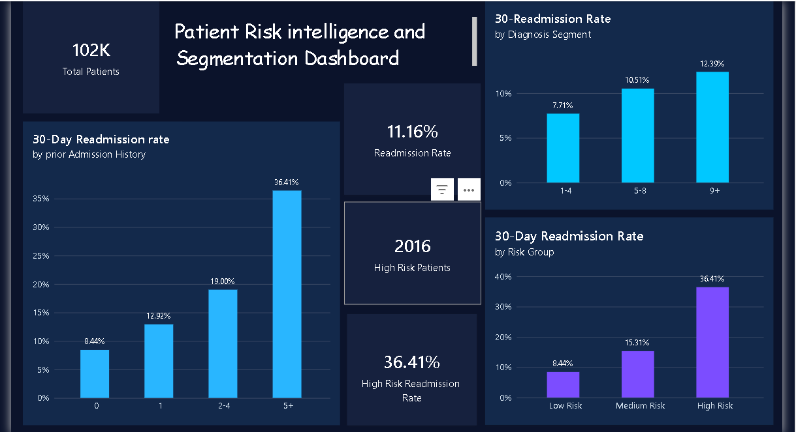

## Diabetic Patient Readmission Risk Intelligence Dashboard
Clinical Risk Segmentation · Logistic Regression · Power BI · SQL · R

## The Business Question
Which diabetic patients are most likely to be readmitted within 30 days — and how can a hospital identify them before discharge?
Unplanned readmissions among diabetic patients are one of the most significant, measurable, and preventable quality challenges in healthcare. In the US, the Centers for Medicare & Medicaid Services (CMS) tracks 30-day readmission rates as a core hospital quality metric under the Hospital Readmissions Reduction Program (HRRP) — linking readmission performance directly to hospital quality scores and operational accountability.
This project builds an end-to-end clinical intelligence pipeline — from raw patient data to an operational KPI dashboard — designed to answer one question that every discharge planning team should be asking: who is most likely to come back, and what can we do before they leave?

## Key Findings
Finding                                                                         Value
Total diabetic patient encounters analysed                                     101,766                     
Overall 30-day readmission rate                                                11.16%
Readmission rate — 0 prior admissions (Low Risk)                               8.44%
Readmission rate — 1 prior admission                                           12.92%
Readmission rate — 2–4 prior admissions                                        19.00%
Readmission rate — 5+ prior admissions (High Risk)                             36.41%
High Risk patients identified                                                  2,016
Readmission rate — 9+ active diagnoses                                         12.39%

Clinical interpretation: Diabetic patients with 5+ prior inpatient admissions are readmitted at 4.3× the rate of those with no prior admissions — a gap driven by a single, observable clinical variable available at the point of discharge. This group is the clearest and most actionable target for intervention.
Operational implication: The volume of excess readmissions in the high-risk diabetic segment — above what would be expected at the low-risk benchmark rate — represents a substantial and measurable quality improvement opportunity. Under CMS HRRP, reducing readmissions in this cohort improves both hospital quality scores and operational efficiency simultaneously.

## The Power BI dashboard delivers three clinical intelligence views:

30-Day Readmission Rate by Prior Admission History — visualises the stepwise risk escalation from 0 to 5+ prior inpatient admissions, making the high-risk threshold immediately visible to clinical and operational stakeholders.
30-Day Readmission Rate by Risk Group — Low / Medium / High segmentation, designed for discharge planning prioritisation.
30-Day Readmission Rate by Diagnosis Segment — readmission rate by number of active diagnoses (1–4, 5–8, 9+), revealing how clinical complexity compounds readmission risk.

## Step 1 — Data Preparation (R + SQL)

Imported raw dataset (101,766 records, 50 variables) into R using readr
Created binary outcome variable: readmit_30 (1 = readmitted within 30 days, 0 = not readmitted within 30 days)
Converted age to an ordered factor with reference level [50–60) — chosen to produce clinically interpretable odds ratios relative to a mid-age reference group
Exported cleaned dataset to CSV and loaded into SQLite database as the Power BI data source

## Step 2 — Logistic Regression (R)
Fitted a binomial logistic regression model predicting the probability of 30-day readmission:
Predictor variables: age group, number of prior inpatient admissions, number of active diagnoses, length of current hospital stay
Output: Odds ratios (OR) with 95% confidence intervals — providing both the direction and statistical precision of each predictor's relationship with readmission
Key result: Prior inpatient admission history was the dominant clinical predictor of 30-day readmission — stronger than age, diagnosis count, or length of stay

## Step 3 — Risk Segmentation
Patients segmented into three operational risk tiers based on prior inpatient admission history — the strongest predictor identified in the regression:
This segmentation converts a statistical model output into an operationally usable classification — enabling discharge teams to prioritise intervention without needing to interpret regression coefficients directly.

## Step 4 — Power BI Dashboard
Connected Power BI directly to the SQLite database (Diabetes_hospital_readmission.db) — replicating a real-world BI data pipeline
Built three KPI visualisations with dynamic filtering by risk group and diagnosis segment
Dashboard designed for hospital operations and discharge planning teams — structured so clinical findings are immediately actionable, not buried in statistical output

## Tools & Technologies
R (readr, dplyr) -  Data import, cleaning, feature engineering, binary outcome creationR (glm, stats)Logistic regression model, odds ratios, 95% confidence intervals
SQL / SQLite - Structured data storage,Power BI live data source
Power BI - Operational KPI dashboard, risk segmentation visualisation

## Executive Brief
The one-page executive brief (executive_brief.pdf) translates the statistical findings into a clinical operations recommendation — structured in consulting format: Problem → Evidence → Operational Implication → Recommended Action.
The recommendation centres on a targeted discharge follow-up protocol for the High Risk segment (5+ prior inpatient admissions): 48-hour post-discharge contact, same-week outpatient scheduling, and care coordinator assignment. This directly addresses the readmission drivers identified by the model and supports improvement against CMS HRRP quality benchmarks — without requiring any new clinical data collection.

What This Project Demonstrates

End-to-end analytics pipeline: raw clinical data → SQL database → statistical modelling → operational dashboard → executive brief. This is the full workflow of a real healthcare analytics engagement.
Clinical reasoning applied to data: choosing the right reference level for age, interpreting prior admissions as a proxy for disease burden, understanding why a 4.3× risk gap matters operationally — not just statistically.
Consulting-format output: the dashboard and brief are designed for a decision-maker, not a data scientist. The question the project answers is not "what does the model say?" but "who do we call before they come back?"

What I Learned
The technical work — cleaning the data, running the regression, building the dashboard — was the straightforward part. The harder and more valuable skill was knowing which question to ask before opening R, which variable mattered most clinically rather than just statistically, and how to translate a logistic regression output into a recommendation a hospital operations team can act on in a morning briefing.
That translation — from statistical finding to operational decision — is what this project was really about.

## Dashboard Preview

